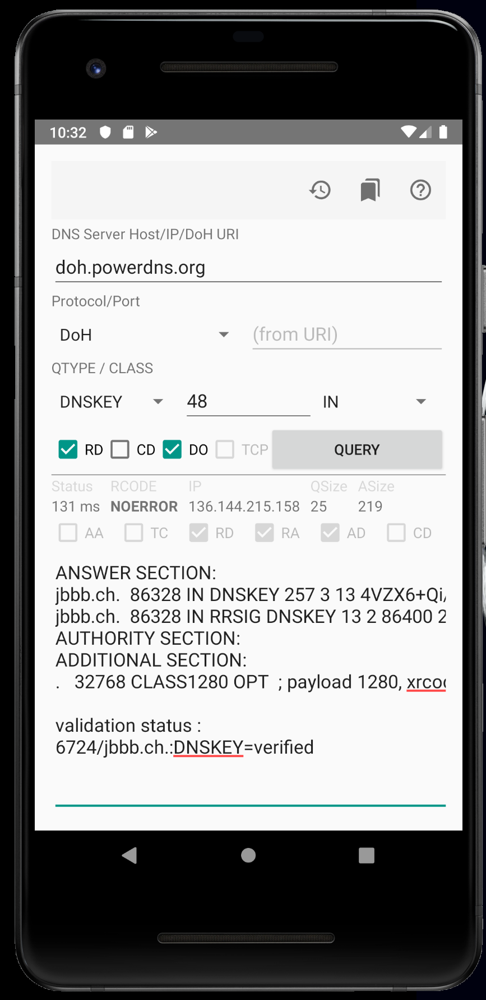

# AndroDNS - The Android DNS Client

This DNS client allows you to perform customised DNS queries directly from your mobile phone. In contrast to most other DNS clients, it does not impose restrictions on what you can query. 

## Features

 * Select recursive or authoritative server to query
 * Specify any question type (not just the most common A/AAAA/MX ....), you can even enter the type ID for new/experimental question types
 * Supports IN/CH/HS query class
 * Set question flags
 * DNSSEC validation for DNSKEYs learned since app start - chain of trust is not verified
 * DNS-over-TLS (DoT) and DNS-over-HTTPS (DoH) support
 * Question / response history
 * Query bookmarks
 * IDNA support

## Download

 * Get AndroDNS from the [Google Play Store](https://play.google.com/store/apps/details?id=androdns.android.leetdreams.ch.androdns)
 * Get AndroDNS from {F-Droid}(https://f-droid.org/de/packages/androdns.android.leetdreams.ch.androdns/)

## Powered by...

This app uses the dnsjava library ( https://github.com/dnsjava/dnsjava ) , Copyright (c) Brian Wellington, Ingo Bauersachs. All rights reserved.

## Screenshot

